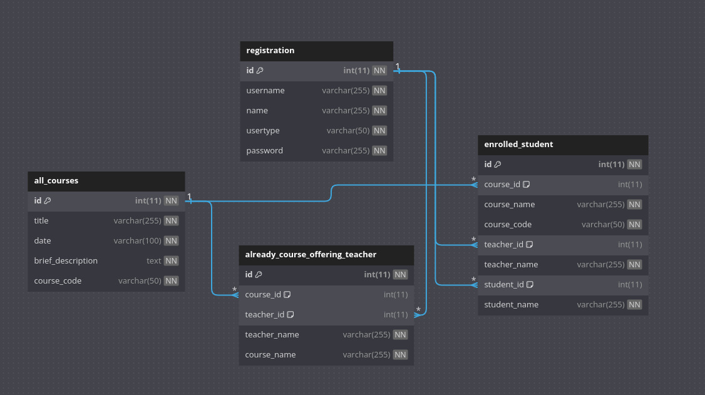

## CourseCraftOnline: Online Course Management System
```
I built this project as part of sust cse, course : CSE-344 (Web Technologies).
```
### Table of Contents

- [Introduction](#introduction)
- [Objectives](#objectives)
- [Technology Used](#technology-used)
- [Features](#features)
  - [User Authentication](#user-authentication)
  - [Admin Functionality](#admin-functionality)
  - [Student Functionality](#student-functionality)
  - [Teacher Functionality](#teacher-functionality)
- [Database Schema](#database-schema)
- [Conclusion](#conclusion)

## Introduction

In the realm of education, efficient management of courses is essential for smooth operation and effective learning outcomes. Inspired by the need for a robust system to facilitate course management, CourseCraftOnline (CCO) was conceived. CourseCraftOnline aims to streamline processes and enhance user experience within educational institutions.

## Objectives

CourseCraftOnline is designed with the following objectives in mind:

- To develop a user-friendly website using Java backend technologies, specifically Servlets and JSP.
- To integrate tailwind for enhanced UI/UX design, ensuring an attractive and intuitive interface.
- To implement secure user authentication using username and password.
- To support three distinct user roles: students, teachers, and administrators, each with tailored functionalities.
- To empower administrators to add new courses and assign teachers to specific courses, fostering efficient course management.
- To enable students to register for courses and access information about their registered courses effortlessly.


## Technology Used

My project relies on the following technologies, libraries, and tools:

**Backend**
- [](https://www.java.com): The core programming language.
- [](https://javaee.github.io/servlet-spec/): Java technology for extending the capabilities of web servers.
- [](https://javaee.github.io/jsp-spec/): Technology for developing dynamic web pages using Java.

**Build Tools**
- [](https://maven.apache.org): A popular build automation and project management tool.

**Web Server**
- [](http://tomcat.apache.org): A widely used web server and servlet container.

**Database**
- [](https://www.mysql.com): A robust relational database management system.

**Version Control**
- [](https://github.com): A web-based platform for version control using Git.

**Integrated Development Environment (IDE)**
- [](https://www.eclipse.org/ide/): A powerful integrated development environment for Java development.

**Frontend Technologies**
- [](https://developer.mozilla.org/en-US/docs/Web/HTML): Markup language for creating the structure of web pages.
- [](https://developer.mozilla.org/en-US/docs/Web/CSS): Stylesheet language for designing the presentation of web pages.

**Java Web Technologies**
- [](https://docs.oracle.com/en/java/javase/14/docs/api/java.sql/java/sql/package-summary.html): Utilized for connecting Java applications to the MySQL database.


# Features

### User Authentication

CourseCraftOnline ensures secure user authentication using username and password credentials.

### Admin Functionality

Administrators have access to a range of functionalities, including:

- Adding new courses to the system.
- Assigning teachers to specific courses.

### Student Functionality

Students can utilize the following features:

- Registering for courses.
- Viewing all registered courses.

### Teacher Functionality

Teachers benefit from the following functionalities:

- Viewing corresponding registered courses.
- Selecting a specific course to view the list of registered students.

## Database Schema



## Conclusion

In conclusion, CourseCraftOnline emerges as a comprehensive solution for online course management, offering a seamless experience for students, teachers, and administrators. With its user-friendly interface and robust functionalities, CourseCraftOnline streamlines course management processes, contributing to enhanced efficiency within educational institutions.
